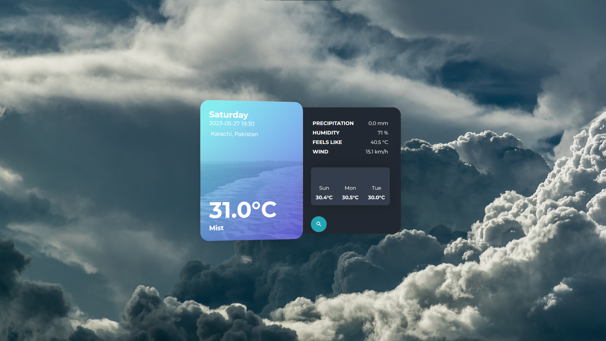
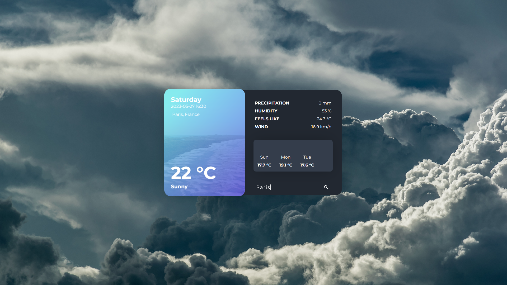
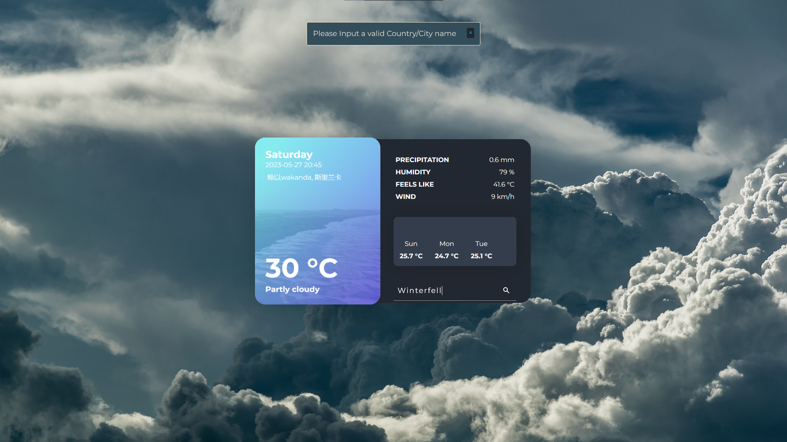

# Weather in AJAX

Previously created weather app now in AJAX and jquery

## [🔗 Link to the orignal repository](https://github.com/mujtaba-jpj/weather-app)

## Screenshots







## Installation

Before beginning the Installation make sure you have both Django==4.1.3 and Requests==2.31.0 installed.

To install this project download project files or run

```bash
gh repo clone mujtaba-jpj/Weather-in-AJAX

```

to clone the github repository, next run the following commands

```bash
cd weatherapp
python manage.py runserver
```
